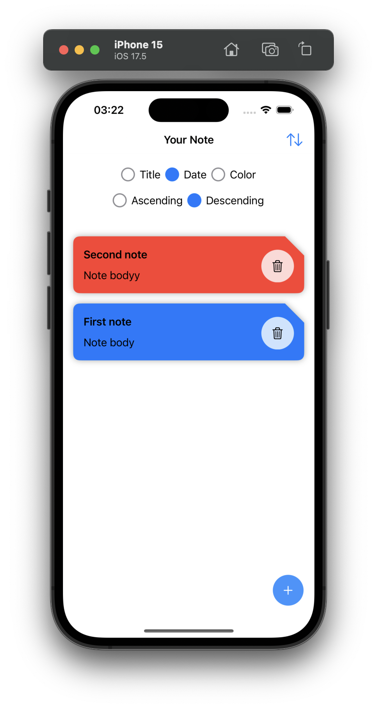

# NoteApp.KMP

A Kotlin Multiplatform (KMP) application for managing notes. This project demonstrates the power of sharing business logic across Android and iOS, while leveraging platform-specific UI and features. The application allows users to create, edit, and manage notes locally, using SQLDelight for database handling.

## Features

- **Multiplatform Support**: Single codebase for Android and iOS.
- **Local Data Storage**: SQLDelight is used to store notes locally on both platforms.
- **Simple CRUD Operations**: Create, read, update, and delete notes easily.
- **Separation of Concerns**: Shared module for business logic and platform-specific modules for UI.
- **Kotlin Coroutines**: For handling background tasks like database operations.

## Technology Used

- **Kotlin Multiplatform (KMP)**: To share code between Android and iOS.
- **SQLDelight**: For local database storage.
- **Ktor**: For networking (if the project includes any API features).
- **Kotlinx Serialization**: To serialize/deserialize data models.
- **Kotlin Coroutines**: For managing asynchronous tasks.
- **Android & iOS Native UI**: Separate UI layers for each platform, leveraging native components.

## Screenshots

_You can add screenshots of your app here, using relative paths or links if they are stored in the `docs` folder._

- Home Screen:  
  

- Add Screen:  
  

## How It Works

The NoteApp.KMP uses Kotlin Multiplatform to share business logic between Android and iOS apps, while keeping the UI platform-specific.

- The **shared** module handles data storage and business logic.
- **SQLDelight** is used for local storage.
- **Kotlin Coroutines** are used for handling asynchronous operations.
- The **Android** and **iOS** modules are responsible for UI.

## Contributing

1. Fork the repository.
2. Create a new branch (`git checkout -b feature/your-feature`).
3. Commit your changes (`git commit -am 'Add some feature'`).
4. Push to the branch (`git push origin feature/your-feature`).
5. Create a new Pull Request.

## License

This project is licensed under the MIT License - see the [LICENSE](/LICENSE) file for details.
